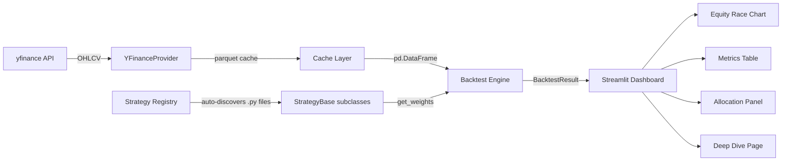

# Quant Strategy Lab

An interactive backtesting platform for comparing trading and investing strategies against market benchmarks — animated equity races, full risk metrics, and a plug-and-play strategy framework.

---

## Screenshots


---

## Features

- **Animated equity race** — Plotly-powered play/pause chart showing all strategies competing through time with a scrubbable time slider
- **Plug-and-play strategy framework** — drop a new `.py` file into `strategies/`, subclass `StrategyBase`, and it appears in the dashboard automatically with no wiring required
- **US and Australian market support** — any valid yfinance ticker accepted, with curated groups for US ETFs, sectors, fixed income, and mega-cap equities
- **Live portfolio allocation** — current recommended weights per strategy based on the most recent rebalance signal
- **Full risk metrics** — CAGR, annualised volatility, Sharpe ratio, Sortino ratio, max drawdown, Calmar ratio, information ratio, and win rate
- **Benchmark comparison** — SPY always computed and overlaid regardless of asset selection
- **Walk-forward backtesting** — no lookahead bias; `get_weights()` only receives data up to and including the rebalance date
- **Persistent caching** — parquet-backed local cache with staleness detection; re-fetches only when stale

---

## Strategy Library

### Passive / Traditional

| Strategy | Description |
|---|---|
| Buy & Hold | Equal-weight the universe on day 1 and hold; portfolio drifts with the market |
| Value Investing | Overweights assets scoring highest on trailing P/E and price-to-book composites; quarterly rebalance |
| Growth Investing | Overweights assets with strongest revenue and earnings growth from fundamentals; quarterly rebalance |
| Dividend Yield | Weights proportional to dividend yield; zero weight for non-payers; quarterly rebalance |

### Quantitative / Active

| Strategy | Description |
|---|---|
| Momentum | 12-month cross-sectional momentum skipping last 21 days to avoid short-term reversal; monthly rebalance |
| Mean Reversion | Inverted 5-day return ranking — recent losers become buys; weekly rebalance |
| Trend Following | Long assets trading above their 200-day SMA, zero weight below; monthly rebalance |
| Low Volatility | Inverse 60-day realised volatility weighting; lower vol assets receive higher allocation |
| Risk Parity | Equalises risk contribution across assets via 60-day rolling covariance; scipy-optimised; monthly rebalance |
| Time-Series Momentum (Vol-Scaled) | Trend signal on each asset's own return history, scaled by realised volatility |
| Residual Momentum | Momentum on market-neutral (residual) returns after stripping systematic factor exposure |
| Max Sharpe | Mean-variance optimisation targeting the maximum Sharpe ratio portfolio on the efficient frontier |
| Min Variance | Minimum variance portfolio via constrained quadratic optimisation |

### ML / Advanced

| Strategy | Description |
|---|---|
| Markov Regime | 2-state Gaussian HMM identifies bull/bear regimes; rotates between equities and defensive assets with probability-smoothed transitions |
| ML Momentum | XGBoost classifier predicts 1-month forward return sign from engineered features; walk-forward retrained every 6 months |
| RL Agent | PPO agent (stable-baselines3) learns continuous portfolio weights; reward approximates Sharpe incentive; pre-trained before backtest |

---

## Architecture

The data, strategy, and execution layers are cleanly separated. Adding a new data provider or strategy requires touching only one file.



**Stack:**

| Layer | Technology |
|---|---|
| Dashboard | Streamlit |
| Charts | Plotly |
| Data | yfinance → parquet (via pandas) |
| Computation | NumPy, pandas, SciPy |
| ML | scikit-learn, XGBoost, hmmlearn, stable-baselines3 |
| Quality | pytest, ruff, mypy |

---

## Quick Start

```bash
git clone https://github.com/your-username/quant-strategy-lab.git && cd quant-strategy-lab
python -m venv .venv && source .venv/bin/activate
pip install -r requirements.txt
streamlit run app.py
```

---

## Project Structure

```
quant-strategy-lab/
├── strategies/          # Strategy implementations — drop new files here
├── engine/              # Walk-forward backtest loop and risk metrics
├── data/                # DataSource abstraction, yfinance provider, parquet cache
├── ui/                  # Streamlit component library (charts, sidebar, tables)
├── pages/               # Streamlit multi-page app (Race, Deep Dive, Methodology)
├── tests/               # pytest suite with synthetic data fixtures
└── app.py               # Entry point
```

---

## Roadmap

- **Alternative data providers** — Databento and OpenBB as drop-in replacements for yfinance via the `DataSource` abstraction
- **Sentiment signals** — news sentiment and options market signals as additional strategy inputs
- **Statistical significance testing** — bootstrap Sharpe ratio confidence intervals and deflated Sharpe ratio to account for multiple hypothesis testing across strategies
- **Jump-diffusion alpha signal** — model return distributions with jump components to isolate alpha from tail events
- **ML interpretability** — SHAP feature attribution for the XGBoost strategy and walk-forward performance attribution
- **Monte Carlo simulation** — forward return distributions via bootstrap and parametric simulation from fitted return models
- **Efficient frontier visualisation** — interactive mean-variance frontier overlay with current portfolio positioning

---

## Built With

- [Python 3.11+](https://www.python.org/)
- [Streamlit](https://streamlit.io/)
- [Plotly](https://plotly.com/python/)
- [pandas](https://pandas.pydata.org/)
- [NumPy](https://numpy.org/)
- [SciPy](https://scipy.org/)
- [scikit-learn](https://scikit-learn.org/)
- [yfinance](https://github.com/ranaroussi/yfinance)
- [XGBoost](https://xgboost.readthedocs.io/)
- [hmmlearn](https://hmmlearn.readthedocs.io/)
- [stable-baselines3](https://stable-baselines3.readthedocs.io/)
